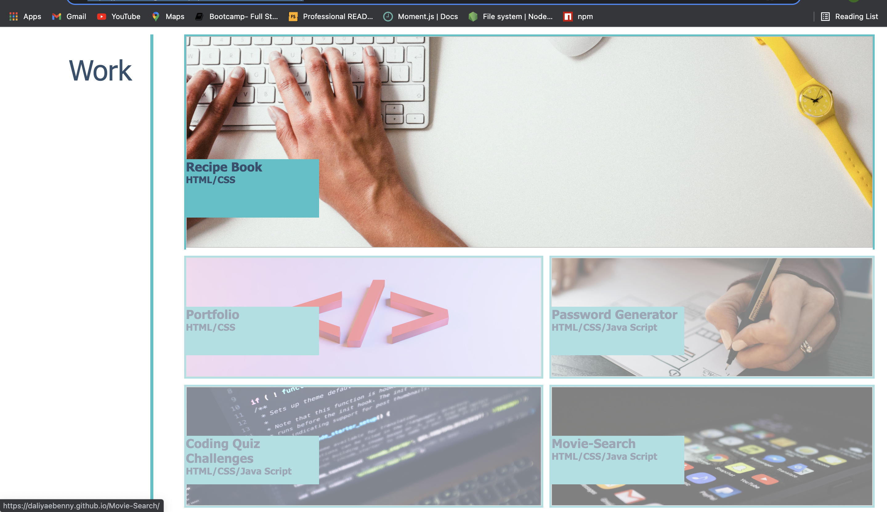
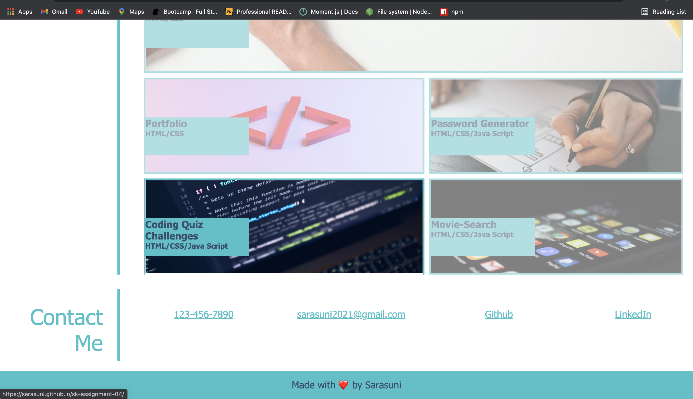

### Name of the Project: ###
My Portfolio

### Description: ###
I'm currently pursuing Web Designing Course to start my career afresh in Tech industry. The purpose of this project is to showcase my web designing skills and eventually build my work portfolio.

### Motivation: ###
I always wanted to build my own Website.

### Technologies used: ###
   * HTML
   * CSS
   * Visual Studio Code Editor

### Website Screen Shots: ###

### Website Contents: ###
1. Header contains portfolio title and navigation buttons with Pseudo classes.
2. Background image contains avtar image and sub title.
3. There are 3 sections which includes
      * About Me
      * Work
      * Resume
      * contact Info
4. When user clicks on Resume button the PDF file will be displayed and can be downloaded by clicking       download button. 
5. When user clicks on Project title box the page is redirected to respective Github live deployment project Webpage.
7. When user clicks on LinkedIn button it redirects to LinkedIn profile Web page.
8. Footer is dedicated to display the website copyright and release information.

###**Live Deployed link:**###
https://sarasuni.github.io/Updated-Portfolio-07/
